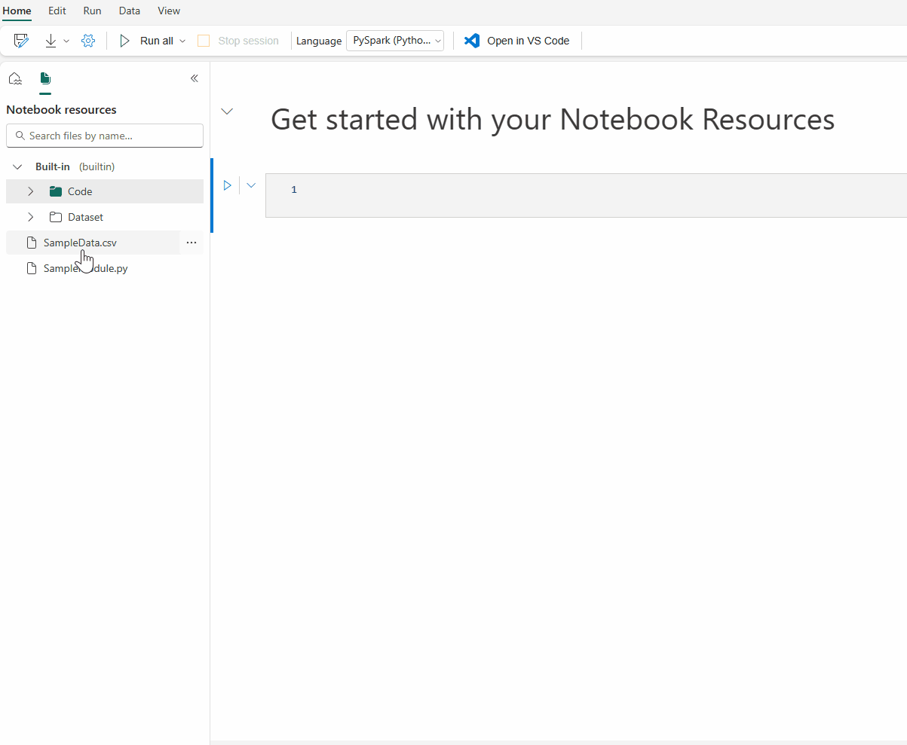
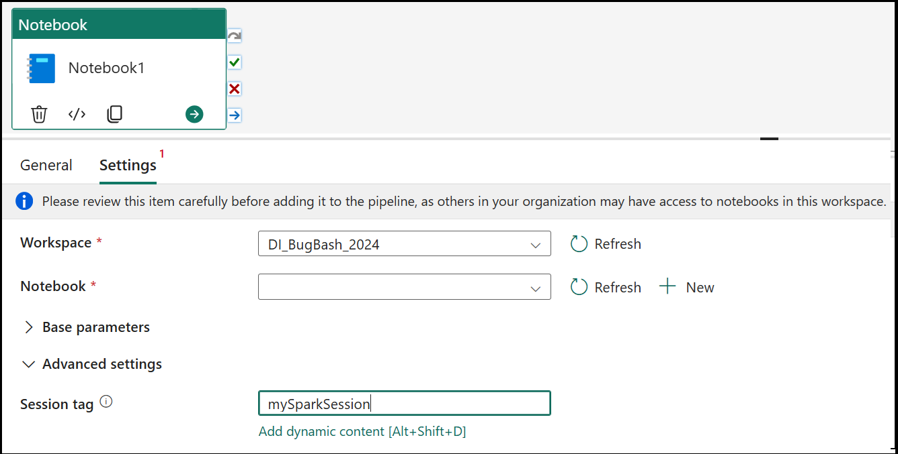

## 🔥 How to Get Started  
You have two ways to approach this lab:  
**Option 1:** Create a new Notebook and follow the step-by-step instructions.  
**Option 2:** Download the pre-built Notebook [module-2-orchestrating-spark/MainNotebook.ipynb](https://github.com/voidfunction/FabCon25SparkWorkshop/blob/main/module-2-orchestrating-spark/MainNotebook.ipynb), run the code, and experiment with it.

#### 📌 Presentation (5 min.)

## 🎯 What You'll Learn 

By the end of this lab, you'll gain insights into:  

- Reference Notebook via ```%run```
- Reference Notebook via ```notebookutils.notebook.run```
- Reference multi notebooks via ```notebookutils.notebook.runMultiple```
- How to use Notebook resources
- How to add notebook into pipelines
- pipeline run with High Concurrency (HC) Session
- Schedule a notebook with light weight scheduler
---

**Get Ready to Code!**
Now that you have an overview, let's get started with hands-on exercises! 🚀


# Context
In this exercise, we will explore how to orchestrate Spark workloads using Azure Data Factory Notebook Activity and Fabric Scheduler. And meanwhile, we provide multiple ways (NotebookUtils.run, RunMultiple, ThreadPools) to reference a notebook in your pipeline.
we will also explore how to use resource files to package code.


## 2.1 Preparation

### 2.1.1 Create your new Notebook with a Spark ```DataFrame```:

<details>
  <summary><strong>🔑 Answer:</strong> Click to reveal</summary>

~~~python
# Create a DataFrame from sample data
df = spark.range(0, 100000)

# display data
display(df)
~~~

</details>

### 2.1.2 Create a new Notebook with name ```childNotebook1``` and ```childNotebook2```

You can also download the notebook and upload them to your workspace:
Download the pre-built Notebooks:

 [module-2-orchestrating-spark/childNotebook1.ipynb](https://github.com/voidfunction/FabCon25SparkWorkshop/blob/main/module-2-orchestrating-spark/childNotebook1.ipynb)

[module-2-orchestrating-spark/childNotebook2.ipynb](https://github.com/voidfunction/FabCon25SparkWorkshop/blob/main/module-2-orchestrating-spark/childNotebook2.ipynb)


<details>
  <summary><strong>🔑 Answer:</strong> Click to reveal</summary>

~~~python
# code cell 1
parameter1 = ''
parameter2 = ''

# Code cell 2
print(f'this is child notebook with parameter1 = {parameter1}\tparameter2 = {parameter2}')

# Code cell 3
# return the function with exit valule
notebookutils.notebook.exit(f'exit with current Notebook Name: {mssparkutils.runtime.context["currentNotebookName"]}')

~~~

</details>


# 2.2 Reference Notebook

We can reference another notebook within current notebook's context.

## 2.2.1 reference notebook via [```%run```](https://learn.microsoft.com/en-us/fabric/data-engineering/author-execute-notebook#reference-run-a-notebook)
The ```%run``` command also allows you to run Python or SQL files that are stored in the notebook’s built-in resources, so you can execute your source code files in notebook conveniently.


```%run [-b/--builtin -c/--current] [script_file.py/.sql] [variables ...]```


<details>
  <summary><strong>🔑 Answer:</strong> Click to reveal</summary>

~~~python
 %run childNotebook1 { 'parameter1': 'value1', 'parameter2': 'value2'}
~~~

</details>

For options:

    ```-b/--builtin```: This option indicates that the command finds and runs the specified script file from the notebook’s built-in resources.

    ```-c/--current```: This option ensures that the command always uses the current notebook’s built-in resources, even if the current notebook is referenced by other notebooks.

## 2.2.2 Reference a notebook via [```notebookutils.notebook.run```](https://learn.microsoft.com/en-us/fabric/data-engineering/notebook-utilities#reference-a-notebook)
This method references a notebook and returns its exit value. You can run nesting function calls in a notebook interactively or in a pipeline. The notebook being referenced runs on the Spark pool of the notebook that calls this function.

```notebookutils.notebook.run("notebook name", <timeoutSeconds>, <parameterMap>, <workspaceId>)```


## 2.2.3 Reference multi notebooks via [```notebookutils.notebook.runMultiple```](https://learn.microsoft.com/en-us/fabric/data-engineering/notebook-utilities#reference-run-multiple-notebooks-in-parallel)
The method ```notebookutils.notebook.runMultiple()``` allows you to run multiple notebooks in parallel or with a predefined topological structure. The API is using a multi-thread implementation mechanism within a spark session, which means the reference notebook runs share the compute resources.
```notebookutils.notebook.runMultiple(["NotebookSimple", "NotebookSimple2"])```

<details>
  <summary><strong>🔑 Answer:</strong> Click to reveal</summary>

~~~python
import json
exitCodes = notebookutils.notebook.runMultiple(["childNotebook1", "childNotebook2"])
print(json.dumps(exitValues, indent=4))
~~~
</details>


# 2.3 Notebook resources
The notebook resource explorer provides a Unix-like file system to help you manage your folders and files. It offers a writeable file system space where you can store small-sized files, such as code modules, semantic models, and images. You can easily access them with code in the notebook as if you were working with your local file system.

### 2.3.1 Download the module [module-2-orchestrating-spark/my.py](https://github.com/voidfunction/FabCon25SparkWorkshop/blob/main/module-2-orchestrating-spark/my.py) and upload it to your Notebook resource folder. 

You can also upload a ```py``` file and then update it with code:
<details>
  <summary><strong>🔑 Answer:</strong> Click to reveal</summary>
~~~python
def func():
	print('this is a function in my own module')
~~~
</details>


### 2.3.2 Drag and drop the file from resource folder to notebook code cell to generate the code



# 2.4 Add notebook into pipeline

The Notebook activity in pipeline allows you to run Notebook created in Microsoft Fabric. You can create a Notebook activity directly through the Fabric user interface. This article provides a step-by-step walkthrough that describes how to create a Notebook activity using the Data Factory user interface.

## Orchestrating as Notebook Activity
Add notebook into new/existing pipelines:


### 2.4.1 Add session tag for High Concurrency Session to reuse your sessions


Trigger a pipeline run:


Select the Settings tab, select an existing notebook from the Notebook dropdown, and optionally specify any parameters to pass to the notebook.


# 2.4.2 Enable Notebook schedule on Notebook settings page

