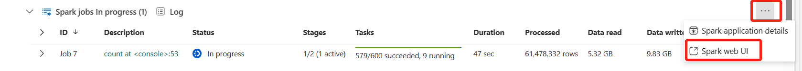
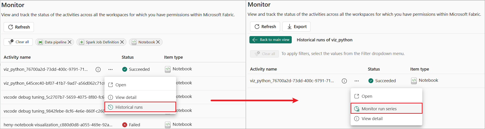
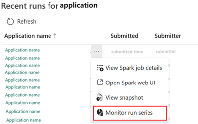
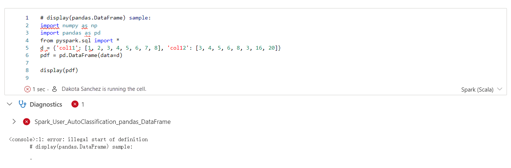
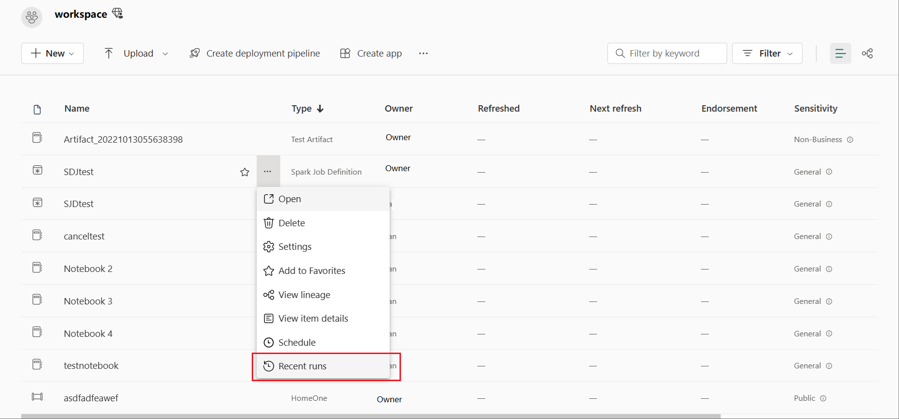

> [!NOTE]
> Timebox: 60 minutes (20 minutes of content | 40 minutes of lab work)
> 
> [Back to Agenda](./../README.md#agenda) | [Back to Start Steps](../module-0-setup/start.md) | [Up next Exercise 2](./../exercise-2/exercise-2.md)
<!-- > #### List of exercises:
> * [Task 2.2 Add Notebook into pipeline](#orchestrating-as-notebook-activity)
> * [Task 2.3 Enable Notebook schedule on Notebook settings page](#23-enable-notebook-schedule-on-notebook-settings-page)
> * [Task 2.4.1 Reference notebook via %run](#241-reference-notebook-via-run)
> * [Task 2.4.2 Reference a notebook via ```notebookutils.notebook.run```](#242-reference-a-notebook-via-notebookutilsnotebookrun)
> * [Task 2.4.3 2.4.3 Reference multi notebooks via ```notebookutils.notebook.runMultiple```](#243-reference-multi-notebooks-via-notebookutilsnotebookrunmultiple)
> * [Task 2.5 Notebook resoures](#25-notebook-resources) -->

# 🚀 Lab 3: Job Scheduling, Monitoring, and Debugging  

## 🎯 What You'll Learn 

By the end of this lab, you'll gain insights into:  
- **Exploring the Spark UI**: Detect task skews & utilization issues
- **Spark Monitoring UI**: Analyze resource usage, view snapshots of your pipeline 
- Live Application Debugging
- High Concurrency (HC) Monitoring
- Emitting Spark Logs & Metrics to Event Hub and Blob Storage

### 🖥️ Context: Microsoft Fabric Spark Monitoring  
Microsoft Fabric’s Spark monitoring offers a **web-UI-driven experience** with powerful built-in tools to:  
✔️ Track Spark applications in progress.  
✔️ Browse historical Spark activity.  
✔️ Analyze performance bottlenecks.  
✔️ Troubleshoot failures effectively.  

With multiple entry points, Spark monitoring ensures seamless access to job details, making it easier to optimize execution and resolve issues. 

## Preparation  

To get started, follow these steps:  

1. **Upload the dataset**  
   - Add the file [`online_retail.csv`](https://github.com/voidfunction/FabCon25SparkWorkshop/blob/main/module-3-scheduling-monitoring-debugging/online_retail.csv) to your lakehouse.  

2. **Import the notebook**  
   - Load the [`SparkMonitoring-2025.ipynb`](https://github.com/voidfunction/FabCon25SparkWorkshop/blob/main/module-3-scheduling-monitoring-debugging/Lab%203%20-%20Spark%20Job%20Monitoring.ipynb) notebook into your environment.  

Once completed, you're ready to proceed with this lab ! 🚀 

## 3.1 Monitor Hub  

The **Monitor Hub** is the centralized portal for tracking Spark activities across different components. With a quick glance, you can:  

- View in-progress Spark applications triggered from **Notebooks, Spark Job Definitions, and Pipelines**.  
- Search and filter Spark applications  
- Drill down into Spark execution details for deeper insights.  

### Accessing the Monitor Hub  

To open the Monitor Hub from the **Fabric portal**, follow these steps:  

1. Navigate to the **left sidebar**.  
2. Click on **Monitor** to access the monitoring pane.  

Here, you can explore your Spark jobs effortlessly.  

  

Stay on top of your Spark applications with ease! 🚀  

## 3.2 Item Recent Runs  

The **Recent Runs** feature helps you track your current and past activities for specific items. It provides key insights, including:  

- **Submitter** – Who initiated the job  
- **Status** – Whether the job is running, completed, or failed  
- **Duration** – How long the job took  
- **Other details** – Additional execution metadata  

### Accessing Recent Runs  

To view recent runs, follow these steps:  

1. Open the **Microsoft Fabric** homepage.  
2. Select the **workspace** where your job is running.  
3. Locate the relevant **Spark Job Definition, Notebook, or Pipeline**.  
4. Open the **context menu** for the item and select **Recent Runs**.  
5. The **Recent Runs** pane will display past execution details for easy monitoring.  

  

## 3.3 Notebook Contextual Monitoring  

**Notebook Contextual Monitoring** brings everything you need into one place—**authoring, monitoring, and debugging Spark jobs** seamlessly. With this feature, you can:  

- **Track Spark job progress** in real time.  
- **View execution details** like tasks and executors.  
- **Access Spark logs** directly at the **Notebook cell level**.  
- Get **real-time insights** from the built-in **Spark Advisor**, which provides code recommendations, execution analysis, and error debugging.  

## 3.3.1 Monitor Spark Job Progress  

A **real-time progress bar** provides instant visibility into Spark job execution within each Notebook cell. This helps you:  

✅ Monitor the status of each Spark job.  
✅ Track task execution across different stages.  
✅ Troubleshoot efficiently with live updates.  

### Try it out!  

🚀 **Run the cell below** and expand the **Spark Jobs** section to view real-time status updates and task progress across execution stages.  

  

Stay on top of your Spark jobs like a pro! 💡🔥  

### 3.3.2 Monitor Resource Usage  

The **Executor Usage Graph** provides a **visual representation** of **Spark job executors and resource consumption**.  

- Currently, only the runtime information of spark 3.4 and above will display this feature. 
- Displays **real-time resource usage** per code cell.  
- Helps optimize performance by analyzing **executor allocation**.  

🔹 **Try it out:** Click on the **Resources** tab to view the line chart for your code cell’s resource usage.  

  

With **Notebook Contextual Monitoring**, you can **debug faster, optimize better, and gain deeper insights** into your Spark jobs—all in one place! 🚀  


### 3.3.3 Access Spark Real-Time Logs  

Need to debug issues quickly? **Contextual Monitoring** brings **Spark logs** directly into your notebook! 🛠️  

- Easily locate **exceptions, warnings, and errors**  
- **Search or filter logs** for faster troubleshooting  
- Click on the **Log tab** in the cell to explore logs in real-time  


## 3.4 OSS based Spark UI/Spark History Server

Use extended Apache Spark history server to debug and diagnose Apache Spark applications.

### 3.4.1 Open the Spark web UI from progress indicator notebook
When an Apache Spark job is triggered, the button to open Spark web UI is inside the More action option in the progress indicator. Select Spark web UI and wait for a few seconds, then the Spark UI page appears.


### 3.4.2 Open the Spark web UI from Apache Spark application detail page
The Spark web UI can also be opened through the Apache Spark application detail page. Select Monitor on the left side of the page, and then select an Apache Spark application. The detail page of the application appears.


### 3.4.3 Advanced enhancement on Spark UI/Spark History Server
[Graph tab in Apache Spark history server](https://learn.microsoft.com/en-us/fabric/data-engineering/apache-spark-history-server#graph-tab-in-apache-spark-history-server)


## 3.5 Run serires
The Apache Spark run series automatically categorizes your Spark applications based on recurring pipeline activities, manual notebook runs, or Spark job runs from the same notebook or Spark job definition.

The run series feature illustrates the duration trend and data input or output trend for each Spark application instance. It automatically scans the run series, detects anomalies, and provides detailed views for individual Spark applications.

You can access the monitor run series feature from the **Monitoring hub**'s historical view and **Recent runs** panel:
|



## 3.6 Spark advisor
The Apache Spark advisor analyzes commands and code run by Apache Spark and displays real-time advice for Notebook runs. The Apache Spark advisor has built-in patterns to help users avoid common mistakes. It offers recommendations for code optimization, performs error analysis, and locates the root cause of failures.



## 3.7 Spark job definition inline monitoring

The Spark job definition Inline Monitoring feature allows you to view Spark job definition submission and run status in real-time, as well as view the Spark job definition's past runs and configurations. You can navigate to the Spark application detail page to view more details.

### 3.7.1 Spark job definition inline monitoring
The Spark job definition inline monitoring feature allows you to view Spark job definition submission and run status in real-time. You can also view the Spark job definition's past runs and configurations and navigate to the Spark application detail page to view more details.


### 3.7.2 Spark job definition item view in workspace
You can access the job runs associated with specific Spark job definition items by using the Recent runs contextual menu on the workspace homepage.



## 3.8 Pipeline Spark activity inline monitoring
For Pipeline Spark Activity Inline Monitoring, deep links have been built into the Notebook and Spark job definition activities within the Pipeline. You can view Spark application execution details, the respective Notebook and Spark job definition snapshot, and access Spark logs for troubleshooting. If the Spark activities fail, the inline error message is also available within Pipeline Spark activities.

[Snapshot](https://learn.microsoft.com/en-us/fabric/data-engineering/spark-detail-monitoring#item-snapshots)


## 3.9 Collect log with Azure log analystics, Azure Storage account and Azure eventhub

The Fabric Apache Spark diagnostic emitter extension is a library that enables Apache Spark applications to emit logs, event logs, and metrics to multiple destinations, including Azure log analytics, Azure storage, and Azure event hubs.

### 3.9.1 Configure with Log Analytics Workspace ID and Key

```
spark.synapse.diagnostic.emitters: <EMITTER_NAME>
spark.synapse.diagnostic.emitter.<EMITTER_NAME>.type: "AzureLogAnalytics"
spark.synapse.diagnostic.emitter.<EMITTER_NAME>.categories: "Log,EventLog,Metrics"
spark.synapse.diagnostic.emitter.<EMITTER_NAME>.workspaceId: <LOG_ANALYTICS_WORKSPACE_ID>
spark.synapse.diagnostic.emitter.<EMITTER_NAME>.secret: <LOG_ANALYTICS_WORKSPACE_KEY>
spark.fabric.pools.skipStarterPools: "true" //Add this Spark property when using the default pool.
```

### 3.9.2 Configure with Azure Storage URI and Access key

```
spark.synapse.diagnostic.emitters: MyStorageBlob
spark.synapse.diagnostic.emitter.MyStorageBlob.type: "AzureStorage"
spark.synapse.diagnostic.emitter.MyStorageBlob.categories: "DriverLog,ExecutorLog,EventLog,Metrics"
spark.synapse.diagnostic.emitter.MyStorageBlob.uri:  "https://<my-blob-storage>.blob.core.windows.net/<container-name>/<folder-name>"
spark.synapse.diagnostic.emitter.MyStorageBlob.auth: "AccessKey"
spark.synapse.diagnostic.emitter.MyStorageBlob.secret: <storage-access-key>
spark.fabric.pools.skipStarterPools: "true" //Add this Spark property when using the default pool.
```

### 3.9.3 Configure with Azure Event Hubs Connection String

```
spark.synapse.diagnostic.emitters: MyEventHub
spark.synapse.diagnostic.emitter.MyEventHub.type: "AzureEventHub"
spark.synapse.diagnostic.emitter.MyEventHub.categories: "Log,EventLog,Metrics"
spark.synapse.diagnostic.emitter.MyEventHub.secret: <connection-string>
spark.fabric.pools.skipStarterPools: "true" //Add this Spark property when using the default pool.
```