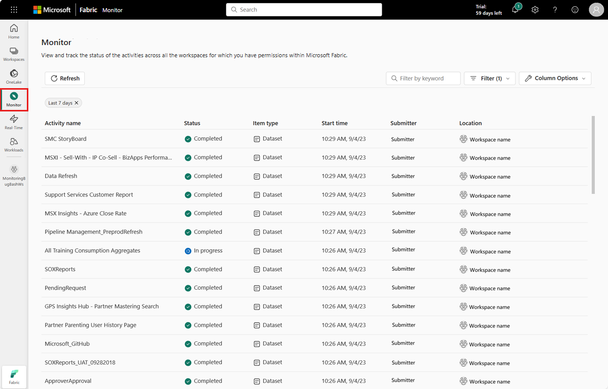
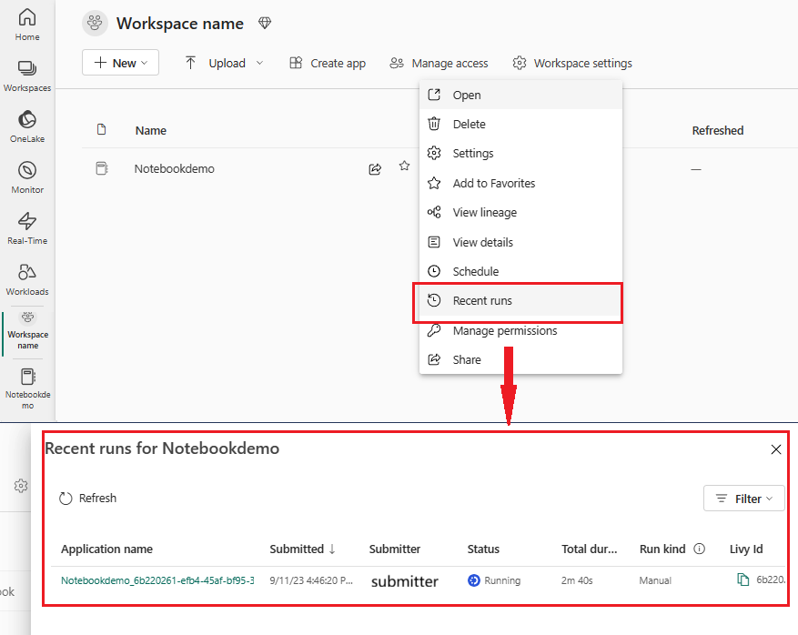
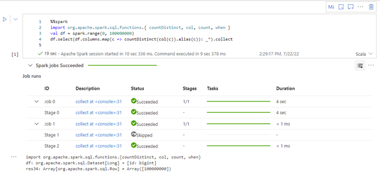
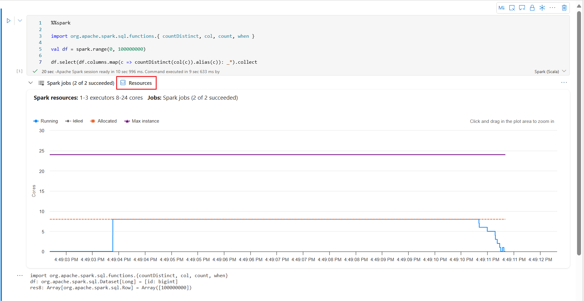
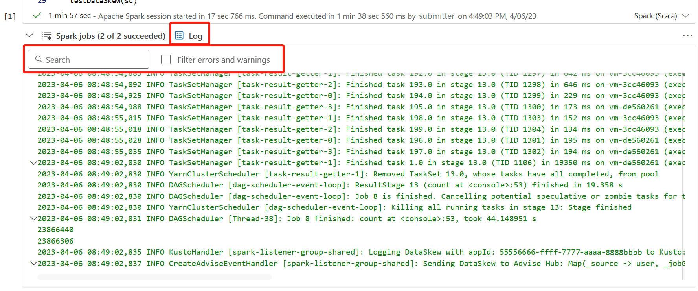
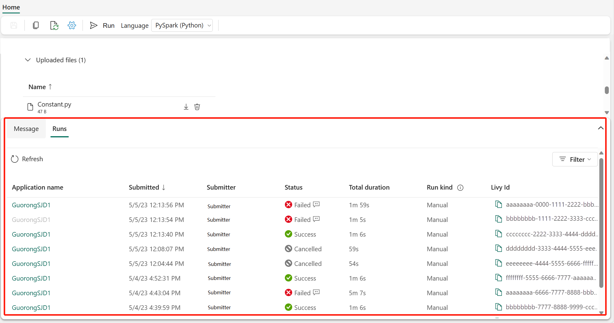
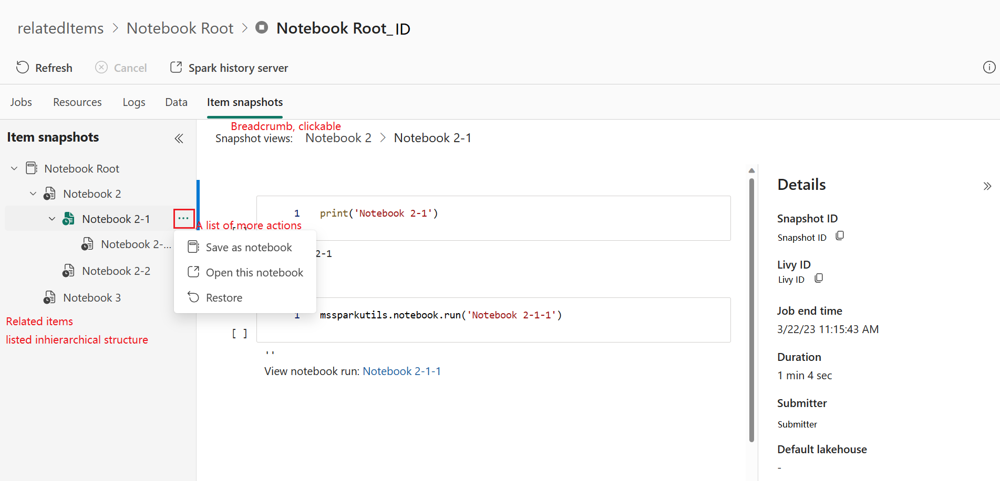
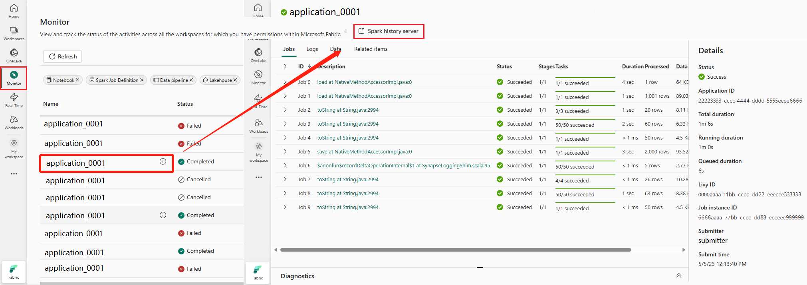

> [!NOTE]
> Timebox: 60 minutes (20 minutes of content | 40 minutes of lab work)
> 
> [Back to Agenda](./../README.md#agenda) | [Back to Start Steps](../module-0-setup/start.md) | [Up next Exercise 2](./../exercise-2/exercise-2.md)
<!-- > #### List of exercises:
> * [Task 2.2 Add Notebook into pipeline](#orchestrating-as-notebook-activity)
> * [Task 2.3 Enable Notebook schedule on Notebook settings page](#23-enable-notebook-schedule-on-notebook-settings-page)
> * [Task 2.4.1 Reference notebook via %run](#241-reference-notebook-via-run)
> * [Task 2.4.2 Reference a notebook via ```notebookutils.notebook.run```](#242-reference-a-notebook-via-notebookutilsnotebookrun)
> * [Task 2.4.3 2.4.3 Reference multi notebooks via ```notebookutils.notebook.runMultiple```](#243-reference-multi-notebooks-via-notebookutilsnotebookrunmultiple)
> * [Task 2.5 Notebook resoures](#25-notebook-resources) -->

# Module 3: Job Scheduling, Monitoring, and Debugging (Long, Anu)
- Navigating Spark UI (for task skews and utilization, native execution, rolling logs for drive and executors)
- Spark monitoring UI (resource usage, cucurrent job analysis,  snapshot of pipeline, HC mode, in progress job, nbutils)
- Notebook contextual monitoring: https://learn.microsoft.com/en-us/fabric/data-engineering/spark-monitor-debug

- Live application debugging (print statements, logging, breakpoints, getNumPartitions, etc.)
- Monitoring for HC (map jobs to notebook, REPL level log)
- public Monitoring api (?)
- Emit spark log/metrics to eventhub/blob storage


## Context
Microsoft Fabric Spark monitoring is designed to offer a web-UI based experience with built-in rich capabilities for monitoring the progress and status of Spark applications in progress, browsing past Spark activities, analyzing and optimizing performance, and facilitating troubleshooting of failures. Multiple entry points are available for browsing, monitoring, and viewing Spark application details.

## Preparation

- upload the file ./online_retail.csv into your lakehouse
- import your notebook: ./SparkMonitoring-2025.ipynb

## 3.1 Monitor hub
The Monitor hub serves as a centralized portal for browsing Spark activities across items. At a glance, you can view in-progress Spark applications triggered from Notebooks, Spark Job Definitions, and Pipelines. You can also search and filter Spark applications based on different criteria and drill down to view more Spark execution details of a Spark application. From the Fabric portal, select Monitor from the navigation pane to open the Monitor hub.

You can access the Monitor pane to view various Apache Spark activities by selecting Monitor from the navigation bar.


## 3.2 Item recent runs
When working on specific items, the item Recent Runs feature allows you to browse the item's current and recent activities and gain insights on the submitter, status, duration, and other information for activities submitted by you or others.

We can open Recent runs pane with the following steps:
- Open the Microsoft Fabric homepage and select a workspace where you want to run the job.
- Selecting Spark job definition \ notebook item context \ pipeline item context menu shows the recent run option.
- Select Recent runs.
- Open the recent run pane from the Spark job definition \ notebook item context.



## 3.3 Notebook contextual monitoring
Notebook Contextual Monitoring offers the capability of authoring, monitoring, and debugging Spark jobs within a single place. You can monitor Spark job progress, view Spark execution tasks and executors, and access Spark logs within a Notebook at the Notebook cell level. The Spark advisor is also built into Notebook to offer real-time advice on code and cell Spark execution and perform error analysis.

### 3.4.1 Monitor Spark Job progress
A Spark job progress indicator is provided with a real-time progress bar that helps you monitor the job execution status for each notebook cell. You can view the status and tasks' progress across your Spark jobs and stages.


### 3.4.2 Monitor Resource usage
The executor usage graph visually displays the allocation of Spark job executors and resource usage. Currently, only the runtime information of spark 3.4 and above will display this feature. Click on Resources tab, the line chart for the resource usage of code cell will be showing.



### 3.4.3 Access Spark Real-time logs
Spark logs are essential for locating exceptions and diagnosing performance or failures. The contextual monitoring feature in the notebook brings the logs directly to you for the specific cell you are running. You can search the logs or filter them by errors and warnings.



## 3.4 Spark job definition inline monitoring

The Spark job definition Inline Monitoring feature allows you to view Spark job definition submission and run status in real-time, as well as view the Spark job definition's past runs and configurations. You can navigate to the Spark application detail page to view more details.

### 3.4.1 Spark job definition inline monitoring
The Spark job definition inline monitoring feature allows you to view Spark job definition submission and run status in real-time. You can also view the Spark job definition's past runs and configurations and navigate to the Spark application detail page to view more details.



### 3.4.2 Spark job definition item view in workspace
You can access the job runs associated with specific Spark job definition items by using the Recent runs contextual menu on the workspace homepage.


## 3.5 Pipeline Spark activity inline monitoring
For Pipeline Spark Activity Inline Monitoring, deep links have been built into the Notebook and Spark job definition activities within the Pipeline. You can view Spark application execution details, the respective Notebook and Spark job definition snapshot, and access Spark logs for troubleshooting. If the Spark activities fail, the inline error message is also available within Pipeline Spark activities.

[Snapshot](https://learn.microsoft.com/en-us/fabric/data-engineering/spark-detail-monitoring#item-snapshots)



## 3.6 OSS based Spark UI/Spark History Server

Use extended Apache Spark history server to debug and diagnose Apache Spark applications.

### 3.6.1 Open the Spark web UI from progress indicator notebook
When an Apache Spark job is triggered, the button to open Spark web UI is inside the More action option in the progress indicator. Select Spark web UI and wait for a few seconds, then the Spark UI page appears.


### 3.6.2 Open the Spark web UI from Apache Spark application detail page
The Spark web UI can also be opened through the Apache Spark application detail page. Select Monitor on the left side of the page, and then select an Apache Spark application. The detail page of the application appears.


### 3.6.2 Advanced enhancement on Spark UI/Spark History Server
[Graph tab in Apache Spark history server](https://learn.microsoft.com/en-us/fabric/data-engineering/apache-spark-history-server#graph-tab-in-apache-spark-history-server)


## 3.7 Run serires
The Apache Spark run series automatically categorizes your Spark applications based on recurring pipeline activities, manual notebook runs, or Spark job runs from the same notebook or Spark job definition.

The run series feature illustrates the duration trend and data input or output trend for each Spark application instance. It automatically scans the run series, detects anomalies, and provides detailed views for individual Spark applications.

You can access the monitor run series feature from the **Monitoring hub**'s historical view and **Recent runs** panel:
|


## 3.8 Spark advisor
The Apache Spark advisor analyzes commands and code run by Apache Spark and displays real-time advice for Notebook runs. The Apache Spark advisor has built-in patterns to help users avoid common mistakes. It offers recommendations for code optimization, performs error analysis, and locates the root cause of failures.


## 3.9 Collect log with Azure log analystics, Azure Storage account and Azure eventhub

The Fabric Apache Spark diagnostic emitter extension is a library that enables Apache Spark applications to emit logs, event logs, and metrics to multiple destinations, including Azure log analytics, Azure storage, and Azure event hubs.

### 3.9.1 Configure with Log Analytics Workspace ID and Key

```
spark.synapse.diagnostic.emitters: <EMITTER_NAME>
spark.synapse.diagnostic.emitter.<EMITTER_NAME>.type: "AzureLogAnalytics"
spark.synapse.diagnostic.emitter.<EMITTER_NAME>.categories: "Log,EventLog,Metrics"
spark.synapse.diagnostic.emitter.<EMITTER_NAME>.workspaceId: <LOG_ANALYTICS_WORKSPACE_ID>
spark.synapse.diagnostic.emitter.<EMITTER_NAME>.secret: <LOG_ANALYTICS_WORKSPACE_KEY>
spark.fabric.pools.skipStarterPools: "true" //Add this Spark property when using the default pool.
```

### 3.9.2 Configure with Azure Storage URI and Access key

```
spark.synapse.diagnostic.emitters: MyStorageBlob
spark.synapse.diagnostic.emitter.MyStorageBlob.type: "AzureStorage"
spark.synapse.diagnostic.emitter.MyStorageBlob.categories: "DriverLog,ExecutorLog,EventLog,Metrics"
spark.synapse.diagnostic.emitter.MyStorageBlob.uri:  "https://<my-blob-storage>.blob.core.windows.net/<container-name>/<folder-name>"
spark.synapse.diagnostic.emitter.MyStorageBlob.auth: "AccessKey"
spark.synapse.diagnostic.emitter.MyStorageBlob.secret: <storage-access-key>
spark.fabric.pools.skipStarterPools: "true" //Add this Spark property when using the default pool.
```

### 3.9.3 Configure with Azure Event Hubs Connection String

```
spark.synapse.diagnostic.emitters: MyEventHub
spark.synapse.diagnostic.emitter.MyEventHub.type: "AzureEventHub"
spark.synapse.diagnostic.emitter.MyEventHub.categories: "Log,EventLog,Metrics"
spark.synapse.diagnostic.emitter.MyEventHub.secret: <connection-string>
spark.fabric.pools.skipStarterPools: "true" //Add this Spark property when using the default pool.
```