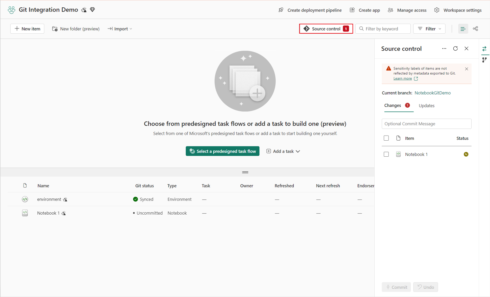
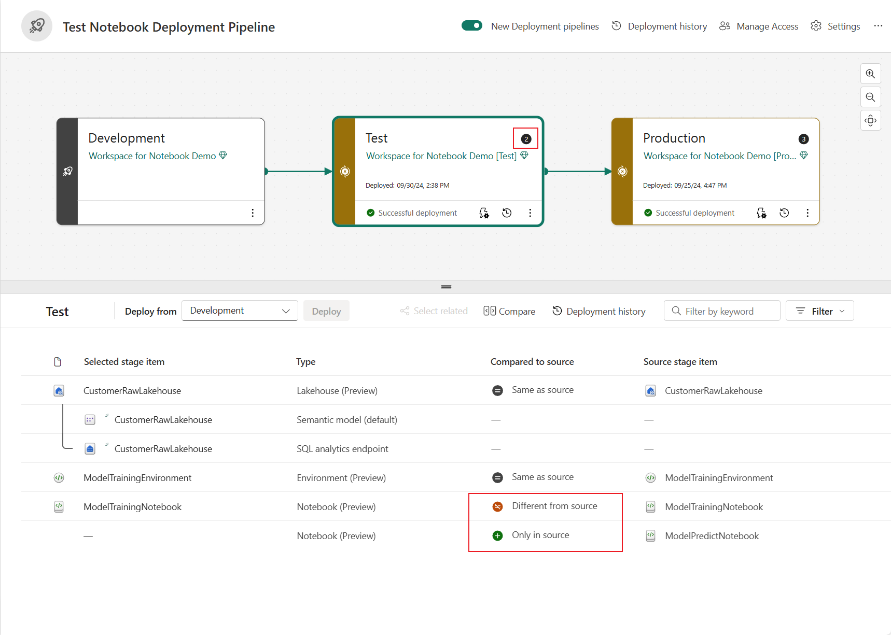

# Module 5: CICD / Misc. (content ONLY, no lab) (Anu, Miles, Long)

1. Sign in to Azure DevOps (https://dev.azure.com/). Create a new organization and create a new project.

 

2. Select repos

 

3. Import your Git repo

 

# Notebook source control and deployment

## Notebook Git integration
Fabric notebooks offer Git integration for source control with Azure DevOps. With Git integration, you can back up and version your notebook, revert to previous stages as needed, collaborate or work alone using Git branches, and manage your notebook content lifecycle entirely within Fabric.

## Notebook in deployment pipelines

You can also use Deployment pipeline to deploy your notebook code across different environments, such as development, test, and production. This feature can enable you to streamline your development process, ensure quality and consistency, and reduce manual errors with lightweight low-code operations. You can also use deployment rules to customize the behavior of your notebooks when they're deployed, such as changing the default lakehouse of a notebook.

## Public APIs

With the notebook APIs, data engineers and data scientists can automate their own pipelines and conveniently and efficiently establish CI/CD. These APIs also make it easy for users to manage and manipulate Fabric notebook items, and integrate notebooks with other tools and systems.

|Action |	Description|
|--|--|
|Create item	|Creates a notebook inside a workspace.|
|Update item	|Updates the metadata of a notebook.|
|Update item definition	|Updates the content of a notebook.|
|Delete item	|Deletes a notebook.|
Get item	|Gets the metadata of a notebook.|
Get item definition	|Gets the content of a notebook.|
List item	|List all items in a workspace.|

The following Job scheduler actions are available for notebooks:

|Action |	Description|
|--|--|
Run on demand Item Job	|Run notebook with parameterization.|
Cancel Item Job Instance	|Cancel notebook job run.|
Get Item Job Instance	|Get notebook run status.|

[Code example](https://learn.microsoft.com/en-us/fabric/data-engineering/notebook-public-api#notebook-rest-api-usage-examples)
